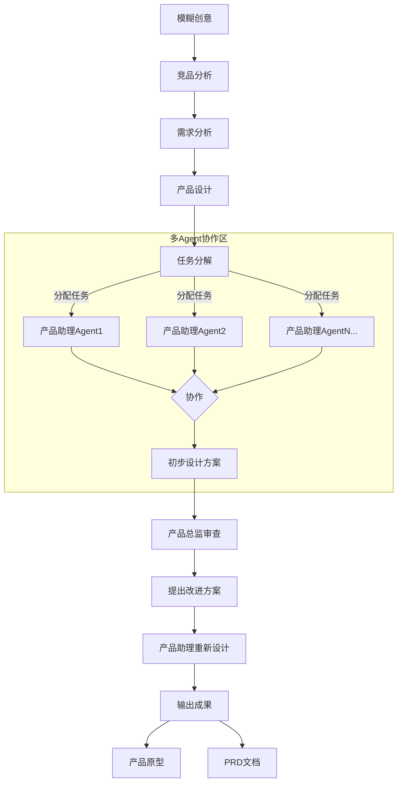

# DeepProduct - AI驱动的产品设计系统

DeepProduct是一个全功能的AI驱动产品设计系统，通过智能Agent协作网络，实现从模糊创意到专业产品原型与PRD文档的全流程自动化。本系统遵循严格的产品研发规范，为产品团队提供端到端的设计方案。

## 系统概述

DeepProduct集成了先进的人工智能技术，建立了一套完整的产品设计生态系统。它不仅能够辅助产品决策，更能够自主完成从市场调研到产品定义的全部流程，显著提升产品开发效率和设计质量。

## 系统流程

产品设计全流程包含以下环节：



## 系统架构

DeepProduct由以下核心模块组成：

1. **创意处理引擎**：接收并结构化初始模糊创意，转化为可分析的数据格式
2. **竞品分析系统**：自动调研市场现有产品，提取关键特性和市场定位，形成竞争格局分析
3. **需求分析平台**：将创意和竞品分析转化为明确的需求规格，并进行优先级排序
4. **产品设计核心**：根据需求生成产品架构、功能清单、功能逻辑和交互设计
5. **任务管理中心**：将产品设计拆解为微粒度任务，并进行智能分配
6. **多Agent协同网络**：
   - 构建高效的Agent协作体系
   - 实现跨专业域信息共享和决策协同
7. **设计审核系统**：模拟产品总监角色，评估设计方案，提供专业反馈
8. **输出生成平台**：生成高质量产品原型和符合行业标准的PRD文档
9. **系统稳定性与可靠性保障**：通过Agent生命周期管理、工作流容错设计和系统监控机制，确保系统稳定运行

## 使用方法

### 前置条件

- Python 3.8+
- 相关AI模型API访问权限

### 快速开始

1. 克隆仓库
```bash
git clone https://github.com/yourusername/DeepProduct.git
cd DeepProduct
```

2. 安装依赖
```bash
pip install -r requirements.txt
```

3. 配置API密钥
```bash
cp .env.example .env
# 编辑.env文件，添加必要的API密钥
```

4. 运行主程序
```bash
python main.py --idea "你的产品创意"
```

## 系统结构

```
DeepProduct/
├── agents/                  # 各类Agent实现
│   ├── competitive_analyzer.py
│   ├── needs_analyzer.py
│   ├── product_designer.py
│   ├── task_decomposer.py
│   ├── director_agent.py
│   ├── agent_manager.py     # Agent管理器，协调多Agent工作
│   ├── agent_registry.py    # Agent注册表，管理可用Agent池
│   └── assistant_agents/    # 产品助理Agents
│       ├── base_assistant.py   # 助理Agent基类
│       ├── ui_assistant.py     # UI专家Agent
│       ├── ux_assistant.py     # UX专家Agent
│       ├── market_assistant.py # 市场专家Agent
│       └── tech_assistant.py   # 技术专家Agent
├── core/                    # 核心功能模块
│   ├── idea_processor.py
│   ├── collaboration_engine.py
│   ├── output_generator.py
│   └── reliability_manager.py  # 系统可靠性管理
├── prompts/                 # 提示词管理
│   ├── base_prompts/        # 基础提示词模板
│   │   ├── agent_base.txt     # Agent基础提示词模板
│   │   └── system_base.txt    # 系统基础提示词
│   ├── agent_prompts/       # 各Agent角色提示词
│   │   ├── orchestrator/      # 协调Agent提示词
│   │   │   ├── base.txt         # 基础人设提示词
│   │   │   ├── task_assign.txt  # 任务分配提示词
│   │   │   └── conflict_resolve.txt # 冲突解决提示词
│   │   ├── product_designer/  # 产品设计师提示词
│   │   ├── ui_assistant/      # UI助理提示词
│   │   ├── ux_assistant/      # UX助理提示词
│   │   └── director/          # 产品总监提示词
│   ├── workflow_prompts/    # 工作流程提示词
│   │   ├── ideation.txt       # 创意阶段提示词
│   │   ├── analysis.txt       # 分析阶段提示词
│   │   └── design.txt         # 设计阶段提示词
│   └── prompt_manager.py    # 提示词管理器
├── workflows/               # 工作流程定义与执行
│   ├── workflow_engine.py      # 工作流执行引擎
│   ├── workflow_templates/     # 预定义工作流模板
│   └── custom_workflows/       # 用户自定义工作流
├── models/                  # 数据模型
│   ├── idea.py
│   ├── requirement.py
│   ├── design.py
│   ├── task.py
│   ├── agent.py            # Agent模型定义
│   └── workflow.py         # 工作流模型定义
├── templates/               # 输出模板
│   ├── prototype_template.py
│   └── prd_template.py
├── config/                  # 配置文件
│   ├── settings.py
│   ├── agent_config.py     # Agent配置
│   └── workflow_config.py  # 工作流配置
├── monitoring/              # 系统监控和日志
│   ├── logger.py           # 日志管理
│   ├── performance_tracker.py  # 性能监控
│   └── error_handler.py    # 错误处理
├── utils/                   # 工具函数
│   ├── api_client.py
│   ├── validators.py
│   └── retry_mechanism.py  # 重试机制
├── main.py                  # 主程序入口
├── requirements.txt         # 项目依赖
└── README.md                # 项目文档
```

## 工作流程详解

1. **创意获取与处理阶段**
   - 系统接收用户提供的初始产品创意
   - 创意处理引擎对模糊概念进行结构化分析和扩展
   - **可靠性保障**: 使用模板化输入验证和异常处理确保数据完整

2. **市场与竞品分析阶段**
   - 系统自动搜集和分析相关领域的市场数据和竞品信息
   - **Agent协作**: 市场专家Agent与竞品分析Agent协同工作，交叉验证结果
   - **数据可靠性**: 实施数据源多样化策略，确保分析结果稳定可靠

3. **需求定义与分析阶段**
   - 基于市场洞察和创意价值生成详细需求规格
   - 运用AI算法确定产品价值主张和功能优先级
   - **多Agent共识机制**: 通过投票、权重评分等方式整合多个专家Agent的观点

4. **产品架构设计阶段**
   - 构建产品整体架构和技术框架
   - 设计核心功能模块和用户交互流程
   - **技术可行性验证**: 技术专家Agent自动评估架构可行性，确保设计落地

5. **设计任务智能分解阶段**
   - 系统将设计工作分解为专业化子任务
   - 自动为各专业Agent分配任务并设定协作规则
   - **负载均衡**: 智能任务分配器确保Agent工作负载合理分配
   - **依赖管理**: 自动识别任务依赖关系，优化执行顺序

6. **多Agent协同设计阶段**
   - **总体协调Agent(Orchestrator)**: 引入中央协调Agent，负责整个协作过程的管理
     - **全局视野**: 掌握所有任务状态和Agent工作情况
     - **资源调度**: 动态分配和调整计算资源，确保关键任务优先执行
     - **决策仲裁**: 当专业Agent间出现分歧时，基于预设规则做出最终决策
     - **进度管控**: 监控整体进度，识别并处理潜在瓶颈
     - **上下文同步**: 确保所有Agent共享最新的设计上下文信息
   - **Agent角色定义**: 明确划分UI、UX、交互、内容等专业Agent职责
   - **协作协议**: 采用标准化的消息传递协议确保Agent间通信一致性
   - **冲突解决机制**: 实现自动化的设计冲突检测与协商解决流程
     - **冲突升级路径**: 定义清晰的冲突处理层级，从自动协商到协调Agent介入再到人工干预
     - **版本管理**: 维护设计决策历史，支持随时回退到之前的设计方案
   - **进度追踪**: 实时监控各Agent工作进度，确保协同效率
   - **协作模式切换**: 根据任务性质自动在并行工作与串行评审间切换

7. **专业审核与优化阶段**
   - 产品总监级AI对设计方案进行全面评估
   - **多维度评估**: 从用户体验、技术实现、业务价值等多角度评价设计
   - **迭代优化**: 建立反馈闭环，指导Agent进行定向优化

8. **成果生成与导出阶段**
   - 自动生成高保真交互原型
   - 输出符合企业标准的完整PRD文档
   - **一致性检查**: 确保所有输出文档间保持逻辑一致性
   - **格式校验**: 自动检查并修正文档格式问题

## 系统稳定性与可靠性保障

### Agent生命周期管理
- Agent状态监控：实时跟踪各Agent工作状态
- 自动重启机制：检测到Agent异常时自动重启或替换
- 备份Agent池：维护备用Agent以应对主Agent故障

### 工作流容错设计
- 检查点机制：定期保存工作进度，支持从断点恢复
- 回滚能力：支持工作流程回滚到稳定状态
- 异常处理策略：针对不同类型的异常定义专门处理流程

### 系统监控与预警
- 性能指标监控：跟踪系统资源使用、响应时间等关键指标
- 质量监控：持续评估AI生成内容质量
- 预警系统：在检测到潜在问题时提前预警

### Agent协作保障
- 消息队列：使用可靠的消息队列确保Agent间通信不丢失
- 共识算法：在关键决策点使用共识算法确保多Agent一致性
- 超时处理：对长时间无响应的Agent实施超时策略

## 多Agent配置与扩展

### Agent配置示例
```yaml
agent_id: product_designer
name: "产品设计专家"
capabilities:
  - ui_design
  - interaction_design
  - information_architecture
knowledge_bases:
  - design_principles
  - ui_patterns
collaboration_rules:
  - can_initiate_with: ["needs_analyzer", "ux_assistant"]
  - requires_approval_from: ["director_agent"]
performance_metrics:
  - design_quality
  - innovation_score
  - consistency_rate
model_config:
  provider: "openai"  # 默认使用OpenAI
  model_name: "gpt-4-turbo"
  temperature: 0.7
  top_p: 1.0
```

### 多模型提供商支持

DeepProduct支持多种大模型服务商，可以为不同Agent角色分配最适合其任务的模型：

```yaml
# 市场分析Agent配置示例
agent_id: market_analyzer
name: "市场分析专家"
model_config:
  provider: "anthropic"  # 使用Claude模型
  model_name: "claude-3-opus"
  temperature: 0.2  # 低温度确保分析准确性

# UI设计Agent配置示例
agent_id: ui_designer
name: "UI设计专家"
model_config:
  provider: "deepseek"  # 使用DeepSeek模型
  model_name: "deepseek-visual"
  temperature: 0.8  # 高温度促进创意设计

# 产品总监Agent配置示例
agent_id: director_agent
name: "产品总监"
model_config:
  provider: "gemini"  # 使用Gemini模型
  model_name: "gemini-pro"
  temperature: 0.4
```

系统目前支持以下模型提供商：
- OpenAI
- Anthropic (Claude)
- Google (Gemini)
- DeepSeek
- OpenRouter
- Ollama (本地部署模型)
- Qwen (通义千问)
- Doubao (豆包)

可在`config/model_providers.yaml`中配置各提供商的API密钥和默认参数。

### 自定义Agent开发
用户可通过继承基础Agent类创建自定义专业Agent，系统将自动将其纳入协作网络。详细开发指南参见`docs/custom_agent_development.md`。

## 后续发展规划

- [ ] 增强系统的跨领域设计能力
- [ ] 添加用户研究和反馈分析模块
- [ ] 扩展输出格式，支持更多行业专用规范
- [ ] 实现持续迭代和版本管理功能
- [ ] 增加与主流开发工具的集成接口

## 贡献指南

欢迎对DeepProduct项目做出贡献！请参阅`CONTRIBUTING.md`文件了解贡献流程。

## 许可证

本项目采用MIT许可证 - 详情请参阅`LICENSE`文件。
